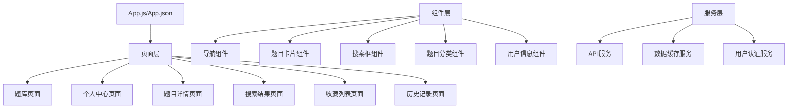
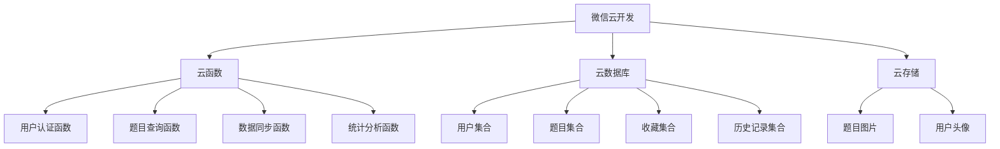

# Design Document

## Overview

GESP考试刷题小程序是一个基于微信小程序平台开发的应用，旨在帮助学生通过题库刷题的形式来练习GESP考试中的选择题、判断题和编程题。本设计文档详细描述了小程序的架构、组件、数据模型、界面设计和技术实现方案。

## 架构

小程序采用前端+云服务的架构模式，具体如下：

### 前端架构

采用微信小程序原生开发框架（MINA框架），使用组件化开发方式，遵循MVVM（Model-View-ViewModel）设计模式。



### 后端架构

使用微信云开发平台，包括云函数、云数据库和云存储三大核心能力。



## 组件和接口

### 页面组件

1. **App 全局配置**
   - 全局样式
   - 导航栏配置
   - 页面路由配置
   - 全局状态管理

2. **题库页面（index）**
   - 搜索框组件
   - 轮播图组件（可选）
   - 题库分类列表组件
   - 底部导航栏组件

3. **个人中心页面（profile）**
   - 用户信息组件
   - 功能菜单组件（收藏、历史记录）
   - 底部导航栏组件

4. **题目详情页面（question-detail）**
   - 题目内容组件
   - 选项组件（选择题）
   - 判断组件（判断题）
   - 代码展示组件（编程题）
   - 答案解析组件
   - 收藏按钮组件

5. **搜索结果页面（search-result）**
   - 搜索框组件
   - 结果列表组件
   - 筛选组件

6. **收藏列表页面（favorites）**
   - 收藏题目列表组件
   - 管理工具栏组件

7. **历史记录页面（history）**
   - 历史记录列表组件
   - 统计信息组件

### 公共组件

1. **导航栏组件（nav-bar）**
   - 属性：当前选中的导航项
   - 方法：导航切换事件

2. **题目卡片组件（question-card）**
   - 属性：题目ID、题目类型、题目简介
   - 方法：点击事件、收藏事件

3. **搜索框组件（search-box）**
   - 属性：占位文本、搜索历史
   - 方法：搜索提交事件、清除事件

4. **用户信息组件（user-info）**
   - 属性：用户头像、用户昵称、登录状态
   - 方法：登录事件、个人信息编辑事件

### API接口

1. **用户相关接口**
   - 登录接口：`/user/login`
   - 获取用户信息：`/user/info`
   - 更新用户信息：`/user/update`

2. **题目相关接口**
   - 获取题库分类：`/question/categories`
   - 获取题目列表：`/question/list`
   - 获取题目详情：`/question/detail`
   - 搜索题目：`/question/search`

3. **用户数据接口**
   - 收藏题目：`/user-data/favorite/add`
   - 取消收藏：`/user-data/favorite/remove`
   - 获取收藏列表：`/user-data/favorite/list`
   - 添加历史记录：`/user-data/history/add`
   - 获取历史记录：`/user-data/history/list`
   - 清除历史记录：`/user-data/history/clear`

## 数据模型

### 用户模型（User）

```json
{
  "_id": "string",        // 用户ID
  "openid": "string",     // 微信OpenID
  "nickName": "string",   // 用户昵称
  "avatarUrl": "string",  // 用户头像URL
  "gender": "number",     // 性别
  "country": "string",    // 国家
  "province": "string",   // 省份
  "city": "string",       // 城市
  "language": "string",   // 语言
  "createTime": "date",   // 创建时间
  "lastLoginTime": "date" // 最后登录时间
}
```

### 题目模型（Question）

```json
{
  "_id": "string",           // 题目ID
  "type": "string",          // 题目类型：choice(选择题), judge(判断题), coding(编程题)
  "category": "string",      // 题目分类：如Java, Python等
  "difficulty": "number",    // 难度级别：1-5
  "content": "string",       // 题目内容
  "options": [               // 选项（选择题）
    {
      "key": "string",       // 选项标识：A, B, C, D
      "value": "string"      // 选项内容
    }
  ],
  "answer": "string",        // 答案：选择题为选项key，判断题为"true"/"false"，编程题为代码字符串
  "explanation": "string",   // 答案解析
  "examples": [              // 示例（编程题）
    {
      "input": "string",     // 输入示例
      "output": "string"     // 输出示例
    }
  ],
  "tags": ["string"],        // 标签
  "createTime": "date",      // 创建时间
  "updateTime": "date"       // 更新时间
}
```

### 收藏模型（Favorite）

```json
{
  "_id": "string",        // 收藏记录ID
  "userId": "string",     // 用户ID
  "questionId": "string", // 题目ID
  "createTime": "date"    // 收藏时间
}
```

### 历史记录模型（History）

```json
{
  "_id": "string",        // 历史记录ID
  "userId": "string",     // 用户ID
  "questionId": "string", // 题目ID
  "isCorrect": "boolean", // 是否回答正确
  "userAnswer": "string", // 用户答案
  "createTime": "date"    // 记录时间
}
```

## 界面设计

### 题库页面

```
+----------------------------------+
|             题库                 |
+----------------------------------+
|                                  |
| +------------------------------+ |
| |        搜索框                | |
| +------------------------------+ |
|                                  |
| +------------------------------+ |
| |        轮播图（可选）        | |
| +------------------------------+ |
|                                  |
| +------------------------------+ |
| | Java选择题                 > | |
| +------------------------------+ |
|                                  |
| +------------------------------+ |
| | Java填空题                 > | |
| +------------------------------+ |
|                                  |
| +------------------------------+ |
| | Java判断题                 > | |
| +------------------------------+ |
|                                  |
| +------------------------------+ |
| | Java代码分析题             > | |
| +------------------------------+ |
|                                  |
| +------------------------------+ |
| | Java大题                   > | |
| +------------------------------+ |
|                                  |
+----------------------------------+
|  题库            |      我的     |
+----------------------------------+
```

### 个人中心页面

```
+----------------------------------+
|            个人中心              |
+----------------------------------+
|                                  |
| +------------------------------+ |
| |        头像  昵称           | |
| +------------------------------+ |
|                                  |
| +------------------------------+ |
| | ✨ 题目收藏               > | |
| +------------------------------+ |
|                                  |
| +------------------------------+ |
| | 📝 刷题记录               > | |
| +------------------------------+ |
|                                  |
| +------------------------------+ |
| | 其他功能项（可选）         > | |
| +------------------------------+ |
|                                  |
+----------------------------------+
|  题库            |      我的     |
+----------------------------------+
```

### 题目详情页面

```
+----------------------------------+
|            题目详情              |
+----------------------------------+
|                                  |
| 题目类型：选择题                 |
| 难度：★★★☆☆                    |
|                                  |
| 题目内容：                       |
| 以下关于Java中的接口描述正确的是？|
|                                  |
| A. 接口可以包含实例变量          |
| B. 接口中的方法默认是private的   |
| C. 一个类可以实现多个接口        |
| D. 接口可以继承类                |
|                                  |
| [选择答案]                       |
|                                  |
| 正确答案：C                      |
|                                  |
| 解析：                           |
| 接口不能包含实例变量；           |
| 接口中的方法默认是public的；     |
| 一个类可以实现多个接口；         |
| 接口只能继承接口，不能继承类。   |
|                                  |
| [收藏]        [下一题]           |
+----------------------------------+
```

## 错误处理

1. **网络错误处理**
   - 实现网络请求超时重试机制
   - 离线模式下使用本地缓存数据
   - 网络恢复后自动同步本地数据

2. **用户输入验证**
   - 搜索关键词长度和内容验证
   - 表单输入数据验证

3. **权限错误处理**
   - 未登录用户访问需要授权的功能时，引导用户登录
   - 用户拒绝授权时，提供友好的提示和引导

4. **数据加载错误**
   - 数据加载失败时显示友好的错误提示
   - 提供重试按钮
   - 关键数据加载失败时的降级策略

## 测试策略

1. **单元测试**
   - 测试各个组件的独立功能
   - 测试数据模型的验证逻辑
   - 测试工具函数和辅助方法

2. **集成测试**
   - 测试页面间的导航和数据传递
   - 测试组件间的交互
   - 测试前端与云函数的交互

3. **端到端测试**
   - 测试完整的用户流程
   - 测试关键功能路径
   - 测试边缘情况和错误处理

4. **性能测试**
   - 测试页面加载时间
   - 测试数据加载性能
   - 测试大量数据下的滚动性能

5. **兼容性测试**
   - 测试不同微信版本的兼容性
   - 测试不同设备尺寸的适配性

## 安全考虑

1. **数据安全**
   - 敏感数据加密存储
   - 使用HTTPS进行数据传输
   - 定期数据备份

2. **用户认证**
   - 使用微信官方的登录认证机制
   - 实现会话管理和过期处理

3. **权限控制**
   - 基于角色的访问控制
   - 云函数的权限验证

4. **输入验证**
   - 前端和后端双重验证
   - 防止SQL注入和XSS攻击

## 部署与发布

1. **开发环境**
   - 本地开发环境配置
   - 开发版小程序部署

2. **测试环境**
   - 体验版小程序部署
   - 测试数据准备

3. **生产环境**
   - 正式版小程序发布
   - 生产环境监控和日志

4. **版本管理**
   - 版本号命名规则
   - 更新日志维护
   - 热更新策略